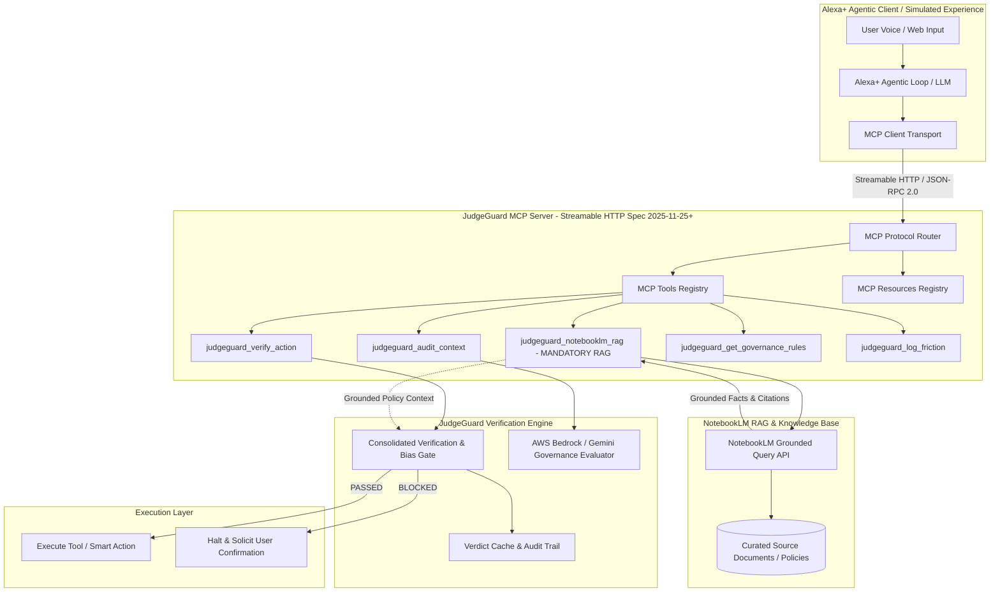

# Design: JudgeGuard Autonomous AI Governance & Alexa+ MCP Bridge

## 1. Context & Overview

Amazon Developer Hackathon 2026 presents a premier opportunity to showcase **JudgeGuard** as the authoritative verification and governance engine for the emerging **Alexa+** agentic ecosystem.

As Alexa+ transitions to multi-agent autonomy and real-world actions (smart home control, commerce, data extraction, cross-device workflows), safety, hallucination prevention, and action verification become critical. JudgeGuard acts as the **Autonomous Gatekeeper (JudgeGuard Gate)**:
- Every high-stakes action (e.g. door unlock, commerce transaction, schema mutation, code deployment) is routed through a JudgeGuard verification pipeline before execution.
- **NotebookLM as Mandatory RAG & Data Engine**: All context, rule sets, policy documents, and external domain data are grounded authoritatively via **NotebookLM RAG** (`judgeguard_notebooklm_rag`) to eliminate hallucination, provide traceable source citations, and guarantee strict factual grounding.
- Implemented as a high-performance **MCP Server** strictly adhering to the **Model Context Protocol (MCP) Streamable HTTP transport (v2025-11-25+)**.
- Paired with an interactive **Alexa+ Simulated Web Experience** delivering real-time agentic reasoning, step-by-step verification feeds, and user confirmation loops.

---

## 2. Architecture & Technical Components

---

## 3. Component Breakdown

### A. `JudgeGuard MCP Server` (Streamable HTTP, Spec 2025-11-25+)
* **Transport**: Streamable HTTP with Server-Sent Events (SSE) streaming support for real-time verification feedback.
* **Core Endpoints**:
  - `POST /mcp`: JSON-RPC 2.0 endpoint handling `tools/list`, `tools/call`, `resources/list`, `resources/read`.
  - `GET /mcp/events`: SSE stream for live audit logs, verification verdict telemetry, and friction tracking.
* **Exposed MCP Tools**:
  1. `judgeguard_verify_action`: Evaluates whether a proposed agent action meets safety, authorization, and consistency rules before execution.
  2. `judgeguard_notebooklm_rag` (**MANDATORY RAG TOOL**): Queries NotebookLM's grounded corpus to retrieve verified facts, rules, and domain data with exact source attribution.
  3. `judgeguard_audit_context`: Performs deep hallucination and factual consistency checks on generated agent responses by comparing them against NotebookLM RAG ground truth.
  4. `judgeguard_check_eligibility`: Verifies user permissions, device states, and environment constraints.
  5. `judgeguard_record_friction`: Automatically generates friction log entries compliant with the hackathon's 10% judging bonus requirement.

### B. `Alexa+ Experience Web Simulator`
* Visual demonstration of the Alexa+ agentic loop interacting with the user.
* Dynamic multi-modal cards showcasing:
  - Natural language intent parsing.
  - Transparent JudgeGuard Pre-Action evaluation (🟡 Pending -> ✅ Approved / 🛑 Blocked).
  - Friction log telemetry and live audit inspection.
* Built using modern Vanilla CSS + responsive JavaScript (no heavy overhead).

### C. `AWS Builder Mini-Challenge Integration`
* **AWS Bedrock Client**: Integrates Claude 3.5 / Amazon Titan models via AWS Bedrock to perform semantic policy evaluation and prompt injection detection.
* **Documented Architecture**: Clear architectural diagrams and configuration samples for AWS deployment.

### D. `Open Source Mini-Challenge Package`
* Packaged as an independent, reusable open-source library (`@judgeguard/mcp-server` or `judgeguard-mcp-core`) with MIT License.
* Clear instructions, unit tests, and CI configuration.

---

## 4. Verification & Testing Strategy

1. **MCP Spec Compliance**:
   - Validate JSON-RPC 2.0 schemas for all tools and resources.
   - Test Streamable HTTP headers, chunking, and session handling.
2. **JudgeGuard Verification Loop**:
   - Automated unit tests covering both PASSED and BLOCKED verdicts.
   - Verification that destructive actions cannot execute if JudgeGuard returns BLOCKED.
3. **Demo & Artifacts**:
   - End-to-end interactive demo video recorded under 3 minutes showing:
     * Problem statement (0:00 - 0:20).
     * Alexa+ simulated action request (0:20 - 0:50).
     * JudgeGuard MCP real-time intervention and policy check (0:50 - 1:45).
     * AWS Bedrock reasoning trace & execution (1:45 - 2:30).
     * Impact, friction log, and production readiness (2:30 - 2:55).
