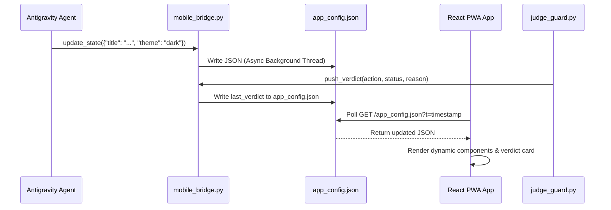

# ⚙️ Mobile App Research Phase 2: Integration & Tooling

> **Objective:** Analyze integration protocols and tooling between Python backend agents and React Mobile PWA.

---

## 🛠️ Architectural Tooling Stack

1. **State Store:** `src/mobile_app_pwa/public/app_config.json`
2. **Agent Bridge:** `src/antigravity_core/mobile_bridge.py`
3. **PWA Runtime:** React + Vite + Axios polling loop (500ms) with `visibilitychange` listener.
4. **Verification Engine:** `judge_guard.py` pushing live verdicts via `bridge.push_verdict()`.

---

## 🔄 Data Flow Protocol

